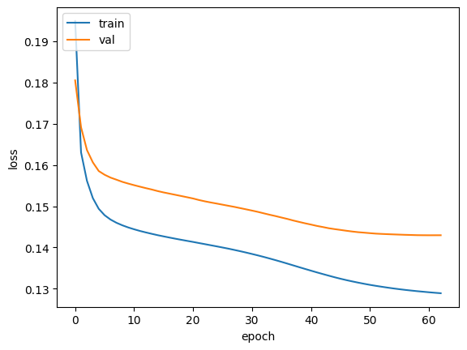

# Introduction

In the area of sports analysis, betting odds, especially the money line, can be interpreted as an indicator of the public sentiment of the game they are watching. A high money line of a team suggests that the public does not have a positive attitude towards their chance of winning. On the contrary, a low money line represents the high likelihood of winning in the public’s perspective. Our objective is to be able to predict the moneyline, total, spread, second-half total, and score for games, and therefore correlate the value of those bets to public sentiment. Although we do not directly predict if a team is going to win, if we predict that the money line is heavily skewed it can be interpreted as a high confidence that the team will win. Therefore, this study on the dataset about the NBA Odds aims to develop NN, RNN, and CNN machine learning models that centers on exploring the public attitude in the context of NBA games using the existing quantized data. The models produced are useful for predicting the money line of future NBA games and thus understanding how the public perceives team strengths and how the house (fairly or unfairly) translates those perceptions into betting odds.

## Source
For our project we will use this kaggle repo as our data source:
https://www.kaggle.com/datasets/christophertreasure/nba-odds-data

# NBA_Odds_Analysis
-link to notebook
-story behind data, previous work
-motivations behind the project
-objectives of the project
-broader impact of the project
-how we preprocessed (choosing model, over/underfitting, etc)
-conclusions
-possible future follow ups
-list of group members and contributions

## data description

**date:** The date on which the game took place

**season:** The year/season during which the game took place

**team:** The team on which the bet is being placed. There are 32 unique teams.

**home/visitor:** Boolean value that represents whether the team on which the bet is placed, is playing at their homeground, or is visiting their opponent.

**opponent:** The team against which our team is playing.

**score:** Our team's final game score

**opponent score:** The enemy team's final game score.

**moneyline:**
The simplest type of bet; if your team wins, you win the bet, no matter by how much (margin) they win. The moneyline payouts are an integer representing the payout if a given team wins; negative for favorites "likely" to win, positive for "underdogs" likely to lose. If negative, represents how much money you must bet to gain $100; if positive, represents how much you will gain on a $100 bet. For example, for teams A and B with moneylines +550 (underdog) and -800 (favorite) respectively: if you bet $100 on A and win you will gain $550, if you bet 800 on B you will gain $100

**total:** Total points bet; also known as over/under bet; this involves predicting if the total points scored by both teams will be over or under the projected point total, which is set by the sportsbook; assume the projected point total is 212, and you bet the final total points will be over the projected point total. If the actual points total after the game is higher than 212, then you win. If it is lower than 212, then you lose. If the actual score is equal to 212, then the bet is refunded.

**spread:** Point spread bet; this bet requires a team to win or lose by a specific number of points, which is set by the sportsbook. For example, if the spread is +3 for Los Angeles Lakers in a game that Lakers vs Clippers, Clippers will have the spread of -3 in this game. If you bet on Lakers, it means that you are betting on the chance that Lakers will win the game by at least 4 points more than Clippers. If Lakers actually win Clippers with at least 4 more points, you win the bet. If Lakers win Clippers with 2 points for fewer or even lose the game, you lose the bet. If Lakers win Clippers with exactly 3 more points, the bet is refunded. On the contrary, if you bet on Clippers, it means you are betting on the chance that Clippers will lose no more than 3 points. Therefore, if Clippers lose Lakers with no more than 2 points or even win Lakers, you win the bet. If Clippers lose Lakers with at least 4 points, you lose the bet.

**secondHalfTotal:** The same as total except that this bet only calculates points in the second half of the game.

## Data distributions - interpretation:

**season:** The data that we have goes from the 2008 season to the 2023 season, and is roughly evenly distributed to have the same number of games per season. This makes sense since the number of games played each season should be pretty similar if no rule changes were made.

**score:** The scores seem to be somewhat normally distributed with the mean and median both being 104. The scores range from 54 to 168, and the standard deviation is 13.30. 

**opponentScore:** As opponentScore and score have the same data points just ordered differently, their distributions are identical.

**moneyLine:** moneyLine seems to have extreme outliers on both sides, as it ranges from -13000 to 6500, but 50% of the data lies between -240 to 195 and 90% of the data lies between -800 and 575.

**opponentMoneyLine:** As opponentMoneyLine and moneyLine have the same data points just ordered differently, their distributions are identical.

**total:** Total number of points has an almost normal distribution ranged from 170.5 to 251, since it calculates points from both teams in a game.

**spread:** The spread has a symmetric distribution because in every game, the magnitude of spread is the same for both teams but the sign is opposite. The data does not have spread to be zero for any entry because it means the game is a tie. However, NBA does not allow tie games.

**secondHalfTotal:** Just like total, secondHalfTotal has an almost normal distribution ranged from 84 to 125, which is nearly half of the minimum and maximum of total because the points added together from both teams for the first half of the game should be roughly equal to the one from the second half.

## Data Visualization

**Fig. 1 | Heat map.** Heat map of our variables to examine correlation between pairs. Generated using seaborn library. Highly correlated pairs were total/second-half total, moneyLine/opponent moneyline, and spread/moneylines. 

**Fig. 2 | Pair Plot.** Pair plot of our variables to give us a sense of how all of our data's features are distributed. Generated using seaborn library. Useful since we have more than 5,000 data points, after which point Shapiro-Wilk test loses accuracy and a visual guide was helpful. Led us to subsample our data points (picked 1000 points randomly) to calculate data distribution, as some features were visibly normal but Shapiro-Wilk test failed initially. Picked Kernel Density Estimation for the diagonal over a histogram for smoothing. 

## Data Preprocessing

### Encoding
To preprocess the data, encoded the home/visitor column to convert the data values to be integers instead of objects. We experimented with two datasets: one using a label encoder, and another with one-hot encoding to represent the teams, and seeing if either method will affect our model's performance. We also one-hot encoded the home/visitor column to keep the data numerical. After analyzing our results, we decided to use a one-hot encoder instead of a label encoder because there is no order between the two categorical columns team and opponent team. Therefore, a one-hot encoding scheme makes more sense to keep the values of these two columns equidistant.

### Data Transformation 
For our day, day of week, and month, we used a sine function to transform the values into periodic data. The benefit is that it gives us a time-series, which is beneficial for our RNN. It also helps with the distance between data (for example, day 31 and day 1 for the next month are right next to each other).

### Normalization and Standardization
Based on the pairplot generated in exploratory analysis, we found that the data in the scores (and opponent scores) columns looks roughly normal, and may benefit from standardization. We used the Shapiro-Wilk test to confirm that the scores and opponent scores were indeed normally distributed, prompting us to standardize those columns. Because the Shapiro-Wilk test pvalues are inaccurate for more than 5000 samples and we have 37k samples, we randomly sampled 1000 data points from each column to perform the Shapiro-Wilk test. For the rest of the numerical data, we applied a min-max normalization as our data is scaled differently depending on the feature. 

### Feature Selection
We discussed whether we need to filter out duplicate games, since there are two entries: one for the home team and one for the away team for each game, but ultimately decided to keep them so our dataset isn't biased toward home or away games. Additionally, we added features from the existing data that may affect our predictions, such as win rate for the teams, and the win rate against the specific opponent. For the latter, there is minimal data between two teams in a season, so we will see if the added feature benefits our predictions. 

### Additional Columns
We created the following additional columns based on the given dataset: win, year, month, day, day_of_week, games_played, cumulative_wins, cumulative_win_rate, cumulative_score, and average_score. The win column represents whether team or opponent won the game. The year, month, day, and day_of_week columns help represent the date in a more manageable numerical format. The games_played, cumulative_wins, cumulative_win_rate, cumulative_score, and average_score columns inform the model as to the team's performance in the current season which may correlate with moneylines and point spreads. For the current season, win would give us a binary win/loss variable compared to just having the scores of both teams. The year, month, day, and day_of_week columns was beneficial for RNNs because of its time-series feature. 

### Prediction targets and inputs
The input columns we fed to our model were: 'date', 'season', 'team', 'home/visitor', 'opponent', 'day', 'day_of_week', 
              'games_played', 'cumulative_wins', 'cumulative_win_rate', 'cumulative_score', 'average_score', 
              'opponent_games_played', 'opponent_cumulative_wins', 'opponent_win_rate',
              as these are all publicly available before the moneyLine is announced.

The targets we had our model predict were: 'moneyLine', 'total', 'spread', 'secondHalfTotal', 'score',
as these will all be important aspects of betting that occur for the given game.

**Fig. 3 | Sample Output.** This is an example output of our model2. It contains predictions for all of our targets.

## Models

### Next 2 Models
One of the next models that we're thinking of building is the RNN. This is due to the fact that our data can be interpreted as a time
series, where we want to predict the next point in the series. In this case, an RNN would be able to generate a robust representation
of each team, which could then be used for the final prediction step. The benefit of doing this over a traditional NN is that it will
be better equipped to handle how each team changes over time, and be better able to predict how that team will be for a timestep that
hasn't been seen before, which is what our current test set is composed of.

### Model 1: Neural Network

We chose a neural network because it can calculate relationships between features easily. A neural network is the most basic and serves as a "control", and later can serve as a foundation for our RNN. We decided 

decisions:
-activation functions
-number of units
-types of layers 
-patience level 2
-epochs
-test size
-Chose Adam optimzer because from our experience (trying different optimizers in our homework), it gives us the best performance. We also looked online and Adam consistently outperformed other optimizers [Source](https://towardsdatascience.com/optimizers-for-training-neural-network-59450d71caf6)
  
-MSE loss

#### Performance of our 1st model:
We use MSE(mean squared error) as the loss function for our model since we are predicting different values and doing a regression task instead of classification. Based on the calculated MSE of different target features we predicted, the results seem pretty good especially for moneyline because it has the lowest MSE. Our model does not predict the score column pretty well because the range of these columns is larger than the others and the scaling strategy we used for this column is standardization, unlike using MinMax normalization for the rest of columns. Based on the calculated MSE for training set, validation set, and testing set, training set has the lowest MSE for all features and testing set has the highest, which is expected.

#### Where does our model fit in the fitting graph:
Based on the plot of training loss and validation loss versus epochs, our model fits when the training process reaches epoch 6, since at epoch 6, the difference between training loss and validation loss is the smallest and after this epoch, the difference starts to increase, which is not what we want.

#### Conclusion
Our first model was kept pretty simple. We used two layers with the relu activation function in order to avoid vanishing gradients. Our model was very quick to early stop and was very good at predicting the moneyline and struggled at predicting the score. Possible improvements could be made by testing with more activation functions and optimizers.

### Model 2: Recurrent Neural Network
For this model, we essentially use an RNN to generate a rich encoding of each team in the current game by passing in the details and results of their last k games. We then use the rich encodings of the home and opponent teams as the inputs for a few dense layers, which gives us our final predictions.

#### Evaluation of data, labels, and loss.
While our labels and loss function still worked well for our second model, we had to somewhat change our data to take full advantage of the RNN's capability to work with time-series data. Essentially, instead of recording the current game's details (such as day of week, month, and one-hot encodings of which teams are playing), we pass in the details of the last k games played for each team, including the result of that game (so for a single game, we might have: day of week, one-hot encoding of opponent team, final score). This allows the RNN to find out how well the team has done recently, and use that to predict how well each team will do in the current game.

#### Training vs Test Error
Our final training error (MSE) was 0.1288, and our final test error was 0.1595. The test error is higher than the training error as expected, since it is much more likely for the model to perform better with data that it has seen before. Compared to model 1's training error of 0.1360 and test error of 0.2536, model 2 performed significantly better. Out of the 5 prediction targets, moneyLine again had the lowest error (train, val, and test) while score again had the highest error (train, val, and test). This is most likely due to the same reasons as before, where score was standardized rather than normalized, making it have a much larger range, and moneyLine is both more predictable and more clustered around the center.

#### Fitting graph
Our model started overfitting around the 65th epoch, prompting our early stopping to stop the model early. This trend is also visible on the graph, as the continued decrease in both training and validation losses stopped shortly before epoch 65, when only the training loss started decreasing and the validation loss started slightly increasing. Compared to the first model, which did start overfitting in the first few epochs, our 2nd model only started overfitting after many more epochs.

#### Hyperparameter tuning, K-fold cross-validation, etc.
After completing hyperparameter tuning by doing a randomized search of 20 trials, we were able to reduce the validation MSE from 0.1454 to 0.1427. Interestingly, the training error increased from 0.1245 to 0.1288, but this may be attributable to the tuned model being more generalized. The final parameters that yielded these results had a mix of different activation functions, and an RNN input sequence length of 3, meaning that only the past 3 games (from this season) for each team was considered. We did not perform K-fold cross-validation during the random search as that would take multiple hours, and the only feature expansion used for this model was taking the sin of date-related columns as specified in the data preprocessing section.

#### Next model
For our next model, we plan on using a Convolutional Neural Network that convolves over the same feature for the previous k games played by each team. This model will function somewhat similarly to the RNN, using the past k games for each team to create some kind of rich encoding of that team's recent history, and using those encodings to make our final predictions through a few dense layers. We switched to this model instead of the SARIMA model that we were planning on using because ultimately we wanted to explore models that were more relevant to this course, and because we believed that the Convolutional layers might be able to capture unique patterns that may not simply be a moving average (which a SARIMA would rely on).

#### Analysis of train loss, val loss, and test loss
For all predictions targets except moneyLine, our train loss was less than our validation loss which was less than our test loss. For moneyLine, train loss was less than test loss which was less than val loss. This weird trend might be due to moneyLine being inherently predictable, or not well captured by our model structure. It might also be due to it's relatively low errors in general making not as important of a target to minimize for our model than our other targets, which all had higher errors in general. 

#### Conclusion
Overall, the errors for each of our prediction targets were lower than what we had for our first model, making the 2nd model a definite upgrade over the 1st model. The test error of 0.1595 was also significantly less than model 1's test error of 0.2536. We conclude that it has excellent predictive power, as signaled by its relatively lower losses for each prediction target. To further improve it, we could spend more time tuning the hyperparameters, or adding more RNN layers. We could also try expanding more of our features to see if that might help capture some previously unnoticed trends.

#### Train, Val, and Test prediction analysis
#TODO

### Model 3: Convolutional Neural Network
For this model, we used the same input data as we did for the recurrent neural network - namely the past k games played by each participating team. A 1D convolution was performed for each feature over these k games to detect patterns in a given feature in the last k games, then this data was passed into a few dense layers to generate our final predictions.

#### Evaluation of data, labels, and loss.
For the convolutional neural network, our loss and labels were the same as the RNN model, as it had worked well in the past and we wanted to keep our data consistent. However, we had to reshape our data in order to feed it into the CNN, which included transposing the team and opponent matrices.

#### Training vs Test Error
Our final average training mse was 0.1262 and our final average test mse was 0.1604. The test error is higher than the training error which is expected because the model tends to perform better on data that it is familiar with. This model's error values were much closer to model 2's error values than model 1's. Once again moneyline had the lowest error for each data set and score had a significantly higher error than the other outputs. This is likely due to the same reasons that we sited prior where score was standardized rather than normalized and thus has a larger range and moneyline is more predictable and more clustered around the center. While the final average training mse of model 3 is 0.1262 and the average of model 2 is 0.1871, it is notable to remove the outlier (score) from the mean. When removed, the average train error of model 3 is 0.003763 and the average train error of model 2 is 0.005597. Likewise, the final average testing mse of model 3 is 0.1604 and the average of model 2 is 0.1595, but, when the outlier is removed from the average, the average test error of model 3 is 0.005657 and the average test error of model 2 is 0.006987.

#### Fitting graph
Our model started overfitting around the 175 epoch where our early stopping is triggered to stop the training. According to the graph below, the training loss and validation loss are gradually decreasing and do not show a sign of increasing even after many epochs. The early stopping is triggered by the validation loss not changing for two epochs. Compared to our first model, this model has a more fluent training and validation process and does not show overfitting. Compared to our second model, this model triggers early stopping at a much later epoch, has a longer training and validation process, and does not show a sign of overfitting. 

#### Hyperparameter tuning, K-fold cross-validation, etc.
Hyperparameter tuning (via 20 randomized search trials) yielded very surprising results on this model. More specifically, there was an incredibly high variation in validation loss across different sets of hyperparameters. This may be due to the fact our model only captures the dataset well with certain ranges of hyperparameters, as otherwise it would be too unnecessarily complex to capture the relevant data without overfitting. The final set of hyperparameters had the model consider only the last 3 games for each team, and only convolve across every pair of consectuive games (kernel_size = 2). The convolutional layer used 32 filters and a tanh activation function, while both dense layers had a linear activation function. The training MSE was 0.1262 and the validation MSE was 0.1417, which were both lower than the untuned training loss of 0.1794 and validation loss of 0.2180. Again, this drastic improvement highlights how much hyperparameter tuning did for the CNN model. Same as for the RNN, we did not perform K-fold cross-validation during the random search as that would take multiple hours, and the only feature expansion used for this model was taking the sin of date-related columns as specified in the data preprocessing section.

#### Next model

#### Analysis of train loss, val loss, and test loss

#### Conclusion
Overall, the CNN model surpassed the previous two models, demonstrating low error rates and high accuracy in predicting most features. It recorded a training MSE of 0.1262 and a validation MSE of 0.1417, marking a significant improvement over both the first and second models. For this model, we applied a convolution operation to each feature column of the team and opponent data individually which leverages the power of convolutional layers to process multiple features in a more efficient way. To improve this model, we may apply k-fold cross-validation into our model evaluation process, which can significantly enhance the reliability of our performance metrics.

#### Train, Val, and Test prediction analysis
Training prediction:

For the training prediction, we see that moneyLine and spread were very well predicted (within 0.01 of the actual values), total and secondHalfTotal were somewhat less well predicted (around 0.2 off from the true values), and score was the least well predicted, being almost 1 away (1 standard deviation).

Validation prediction:

Here we see that total is the best predicted (0.02 away), while moneyLine, spread, and secondHalfTotal are the second best predicted (0.04 away), and score is again the least well predicted (0.66 stds away)

Test prediction:

For this test prediction, both moneyLine and spread are extremely close to the actual values (<0.01 away), while total and secondHalfTotal are also quite well predicted (0.02 and 0.08 off respectively). Score is actually somewhat close to the actual value this time at <0.3 away.

Analysis:

Overall, it is clear that moneyLine is consistently well predicted, and so are spread, total, and secondHalfTotal, which is consistent with the low MSEs that we calculated. Score, on the other hand, seems to be consistently close to 0, which by definition of standardization, is the mean of the data. This suggests that our model might lack variance when predicting score, choosing instead to predict the 'safe' values which are close to the center of the data. This further explains why the MSE of score was so much higher than the other prediction targets even considering their different scaling techniques. The individual samples that we selected this time from the training, valid, and test sets did not necessarily reflect how well the sets were predicted overall (since we only looked at so few samples), but the general relationship between how well each of our prediction targets were predicted did manifest.

### Discussion
Initially, we wanted to try using is an SARIMA (Seasonal Auto-Regressive Integrated Moving Average). This model showed promise for the same reason as the RNN: it is built to account for changes/constants over time. We chose the seasonal variant of the base ARIMA because we suspected that teams would have varying performance based on seasonal changes (not the season variable but like month or day of week for example), which we hoped this variant would be able to capture. We instead chose to do a CNN to focus on the models discussed in-class

### Collaboration

### Conclusion

